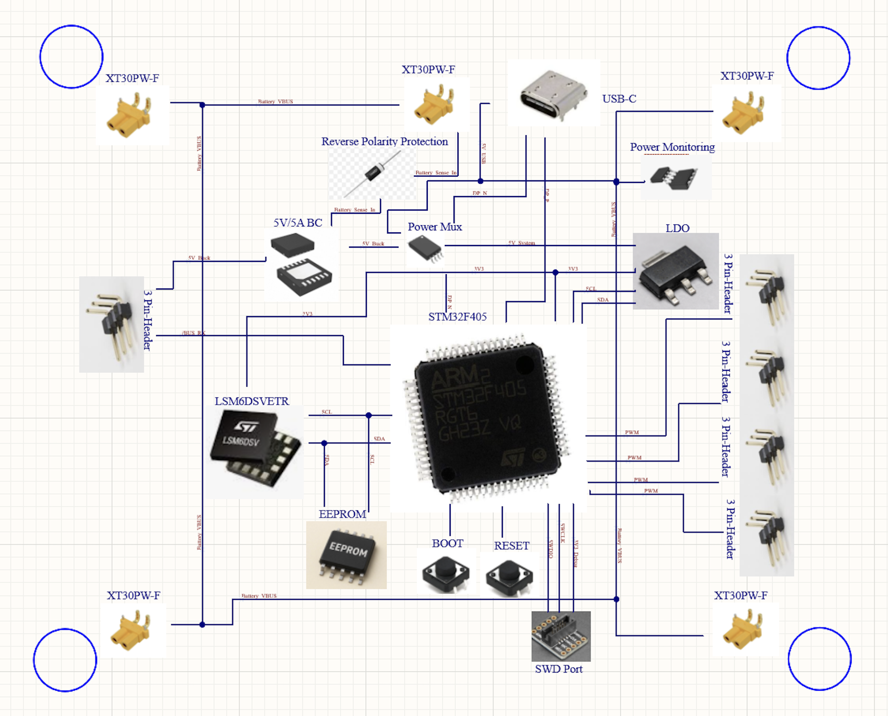
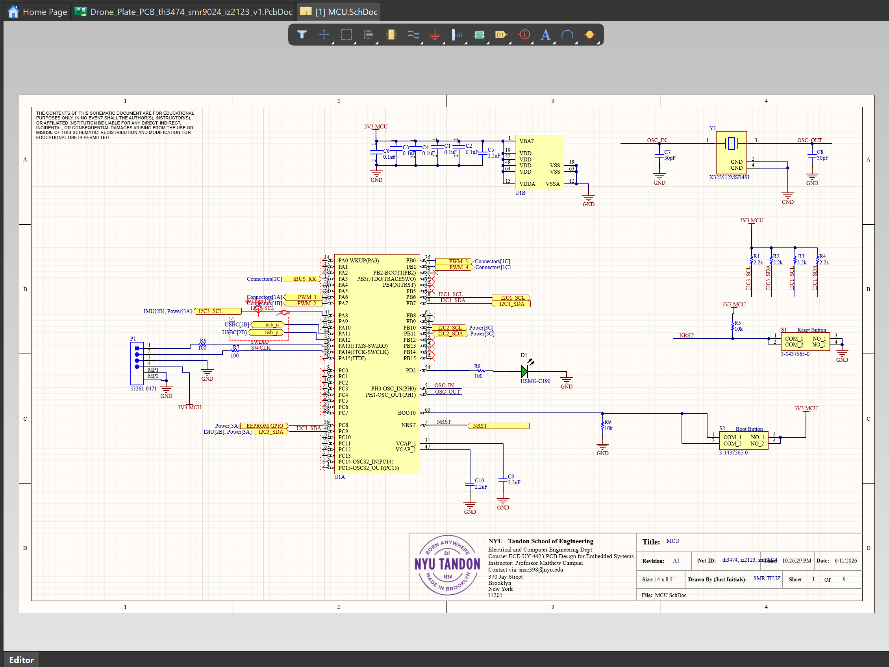
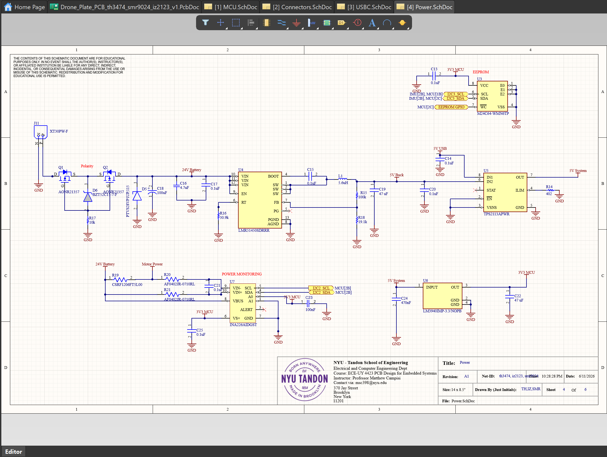
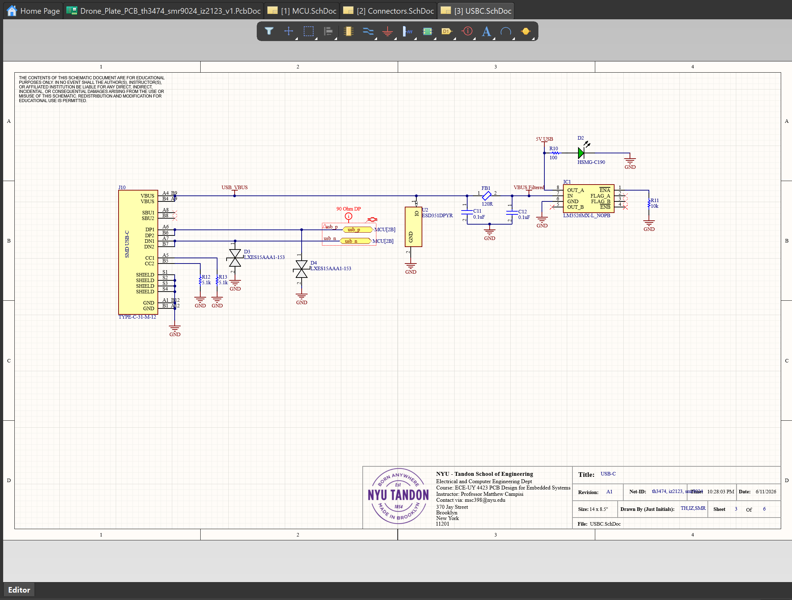
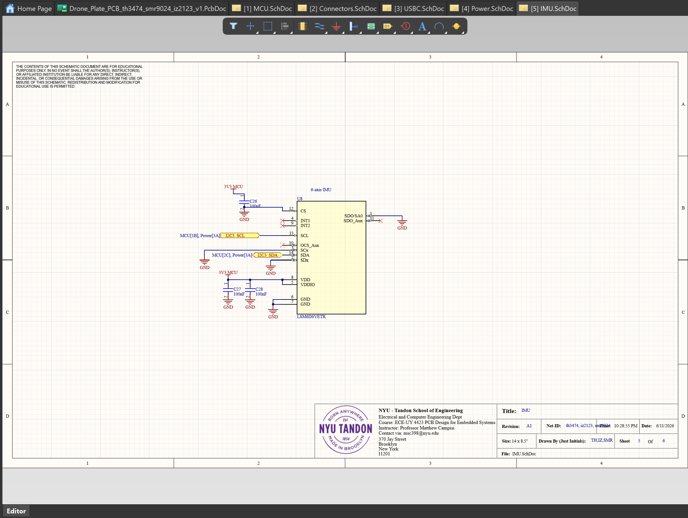
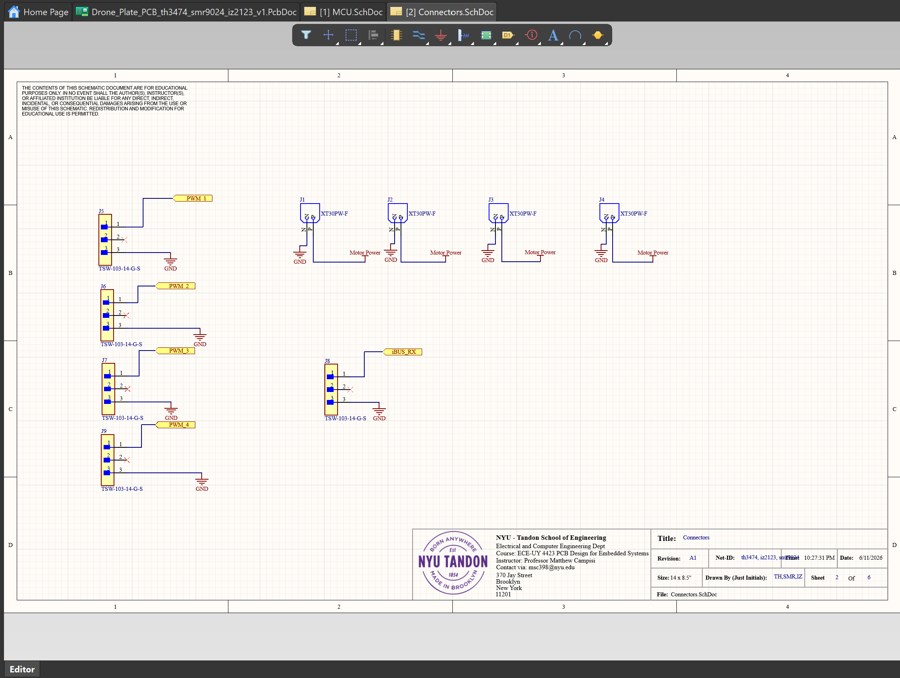
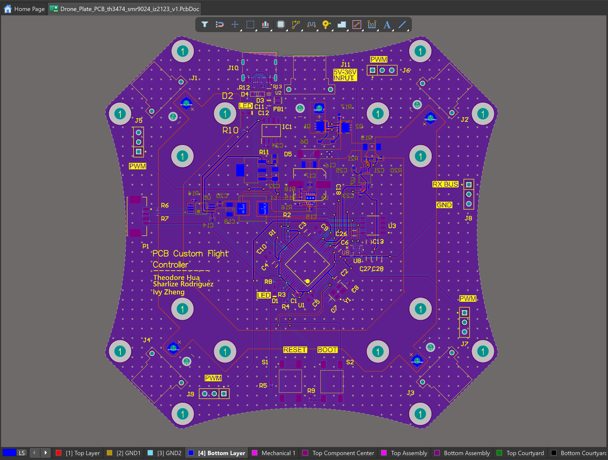
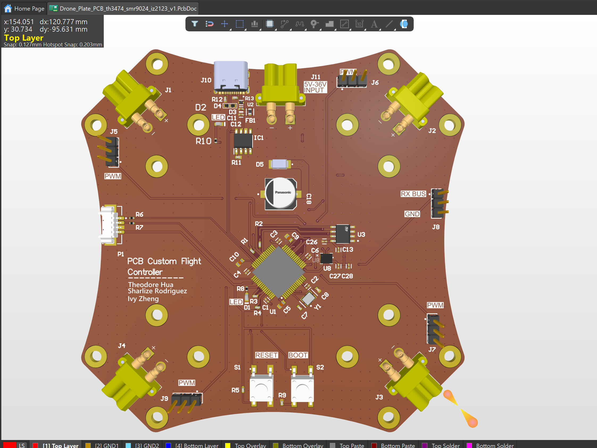
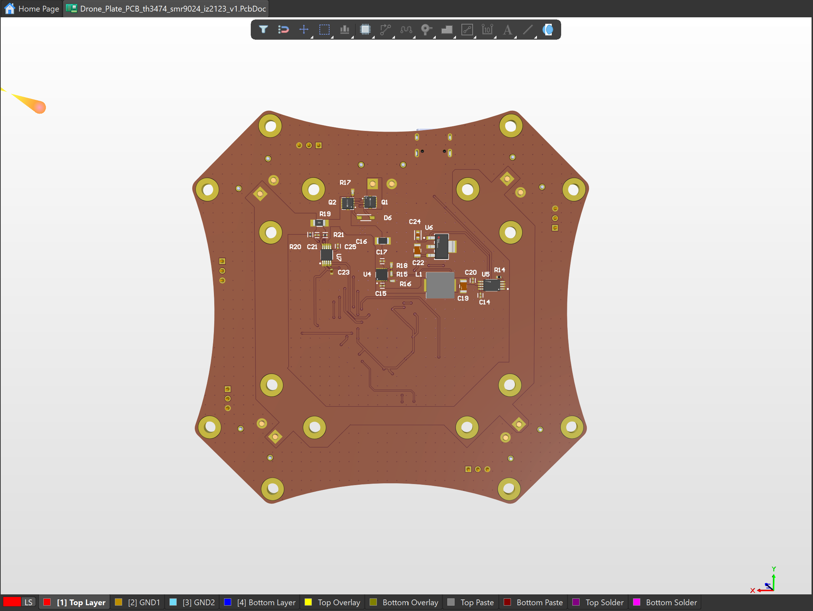

# Drone Flight Controller PCB

## Overview

This repository contains all design files for a custom drone flight controller PCB built around the **STM32F405RGT6** microcontroller. The board integrates every subsystem needed for autonomous quadrotor flight onto a single 4-layer PCB that physically fits a standard **DJI F450 drone frame centerplate**, aligned using M3 screw mounts.

The design was completed in **Altium Designer** and is ready for fabrication at **JLCPCB**.

---

## Features

| Category | Details |
|---|---|
| Microcontroller | STM32F405RGT6 (168 MHz Cortex-M4) |
| IMU | LSM6DSVETR — 6-axis (accelerometer + gyroscope) |
| Radio Receiver Input | FlySky iBUS via UART (PA3) |
| Motor Outputs | 4× PWM signals to ESC connectors (PB1, PB2, PB3, PD6) |
| Power Input | 6V–36V LiPo via XT30PW-F connector |
| Power Rails | 5V @ 5A (buck converter), 3.3V (LDO) |
| USB Interface | USB-C (OTG, USB 2.0 full-speed) on PA11/PA12 |
| EEPROM | M24C64 — I2C, stores PID tuning & calibration data |
| Power Monitor | INA226AIDGST — voltage & current sense on dedicated I2C bus |
| Debug Interface | SWD (PA13/PA14) + USB-C |
| Status Indicator | Onboard LED on GPIO (PD2) |
| Form Factor | DJI F450 centerplate compatible, M3 mounting holes |

---

## Repository Structure

```
DroneFC_th3474_smr9024_iz2123/
├── Schematics/
│   ├── MCU.SchDoc              # STM32F405 I/O & power banks, crystal, buttons
│   ├── Connectors.SchDoc       # PWM ESC outputs, iBUS receiver connector
│   ├── USBC.SchDoc             # USB-C OTG, ESD protection, inrush limiting
│   ├── Power.SchDoc            # Buck converter, LDO, power mux, INA226, EEPROM
│   ├── IMU.SchDoc              # LSM6DSVETR 6-axis IMU on I2C3
│   └── Block_Diagram.SchDoc    # System-level block diagram
├── PCB/
│   └── DroneFC_th3474_smr9024_iz2123.PrjPcb
├── Fabrication/
│   ├── CAMtastic1.Cam          # Gerber files
│   └── CAMtastic2.Cam          # NC Drill files
├── Images/
│   ├── Block_Diagram.png
│   ├── MCU_Schematic.png
│   ├── Connector_Schematic.png
│   ├── USB-C_Schematic.png
│   ├── Power_Schematic.png
│   ├── IMU_Schematic.png
│   ├── The_2D_view_for_both_top___bottom_side_of_the_PCB_drone.png
│   ├── The_3D_view_top_side_of_the_PCB_drone.png
│   └── The_3D_view_back_side_of_the_PCB_drone.png
└── README.md
```

---

## System Architecture

The board is organized into **five functional blocks**:

### 1. Power Block
- **Input:** 6V–36V LiPo battery via XT30PW-F connector
- **Reverse polarity protection** using back-to-back MOSFETs (AONR21357)
- **TVS diode** (BZT52C31) clamps voltage spikes up to 31V
- **50V bulk capacitor** absorbs inrush and switching transients
- **Buck converter** (LMR51450DRRR) steps down to a stable **5V @ 5A**
- **Power Mux** (TPS2113APWR) automatically selects between USB 5V and buck 5V
- **LDO** (LM3940IMP-3.3) steps down muxed 5V to a clean **3.3V** for logic

### 2. MCU Block
- **STM32F405RGT6** split into two schematic symbols: Power Bank (U1B) and I/O Bank (U1A)
- 8 MHz crystal oscillator (X3225512MSB4SI) with 30 pF load capacitors
- Decoupling capacitors on all VDD/VDDA pins
- RESET and BOOT tactile push buttons
- Pull-up resistors on BOOT0, NRST, and I2C lines
- SWD debug port (SWDIO/SWCLK) on PA13/PA14 via 4-pin header (53261-0471)
- Status LED (HSMG-C190) on PD2 through 100 Ω current-limiting resistor

### 3. Sensor Block
- **LSM6DSVETR** (6-DoF IMU) on **I2C3** bus (I2C3_SCL = PB6 / PB3, I2C3_SDA = PB7 / PC9)
  - 100 nF decoupling capacitors on VDD and VDDIO
  - CS pin tied high to select I2C mode
- **M24C64** EEPROM on **I2C3** bus (shared with IMU)
  - Stores calibration offsets, PID tuning values, and configuration across power cycles
- **INA226AIDGST** power monitor on a separate **I2C2** bus (PB10/PB11)
  - Kelvin-connected current shunt for accurate current measurement
  - Monitors battery voltage and current for low-voltage cutoff and flight-time estimation

### 4. I/O Block
- **FlySky iBUS receiver** input on `iBUS_RX` → PA3 (USART2_RX)
- **4× PWM motor outputs** to individual ESC connectors (TSW-103-14-G-S, 3-pin):
  - PWM_1 → PB1 (TIM3_CH4)
  - PWM_2 → PB2 (TIM3_CH3)
  - PWM_3 → PB0 (TIM3_CH3)
  - PWM_4 → PD6 (TIM2)
- High-current motor power routed separately through XT30PW-F connectors (J1–J4)

### 5. USB-C Block
- **TYPE-C-31-M-12** receptacle with USB 2.0 differential pair (usb_p / usb_n) on PA11/PA12
- CC resistors (5.1 kΩ) for USB-C power role detection
- **ESD351DPYR** diode protects VBUS from electrostatic discharge
- **JLXES15AAA1-153** bidirectional TVS diodes (~0.05 pF) on each D+/D− line
- **Pi filter** (FB1 + C11 + C12) on USB VBUS for EMI suppression
- **LM3526MXC-L** inrush current limiter and power switch on VBUS
- Impedance-matched 90 Ω differential traces per JLCPCB 4-layer specs

---

## Pin Assignment Summary

| Signal | STM32 Pin | Peripheral |
|---|---|---|
| USB D+ | PA12 | USB OTG FS |
| USB D− | PA11 | USB OTG FS |
| SWDIO | PA13 | SWD |
| SWCLK | PA14 | SWD |
| iBUS_RX | PA3 | USART2_RX |
| IMU SCL | PB6 / PB3 | I2C3_SCL |
| IMU SDA | PB7 / PC9 | I2C3_SDA |
| Power Monitor SCL | PB10 | I2C2_SCL |
| Power Monitor SDA | PB11 | I2C2_SDA |
| PWM_1 | PB1 | TIM3_CH4 |
| PWM_2 | PB2 | TIM3_CH3 |
| PWM_3 | PB0 | TIM3_CH3 |
| PWM_4 | PD6 | TIM2 |
| LED | PD2 | GPIO Output |
| EEPROM GPIO | PC8 | GPIO / I2C3 |

---

## PCB Layout

### Layer Stackup (JLCPCB 4-Layer "No Requirement")

| Layer | Function |
|---|---|
| Top (L1) | Signal routing + GND copper pour |
| L2 | GND1 — solid ground plane |
| L3 | GND2 — solid ground plane |
| Bottom (L4) | Signal routing + GND copper pour |

- Every signal trace has a solid ground return path directly beneath it, minimizing EMI.
- **High-current paths** (battery input, motor power, buck converter output) use **copper polygons**.
- **GND copper pour** on top and bottom layers with **GND via stitching** (≤ 80 mil spacing).
- **Direct connect** used for all vias (no thermal relief on vias).
- Buck converter IC (LMR51450DRRR) has **3 GND vias** through its exposed thermal pad.
- IMU placed at board center, away from switching noise sources.
- USB-C connector on one board edge; battery/motor connectors on the opposite edges.
- **Kelvin connection** at the INA226 current shunt for accurate differential voltage sensing.

### Design Rules (JLCPCB Compliant)

- Minimum trace width, clearance, hole sizes, and board-edge spacing set per JLCPCB manufacturing specs
- USB differential pair traces calculated for **90 Ω differential impedance** using 0.5 oz inner copper weight

---

## Schematic Pages

| Sheet | Title | Description |
|---|---|---|
| 1 | MCU | STM32F405 power and I/O banks, crystal, buttons, SWD, LED |
| 2 | Connectors | PWM ESC signal outputs, iBUS receiver header |
| 3 | USB-C | USB-C receptacle, ESD, TVS, pi filter, inrush limiter |
| 4 | Power | Buck converter, power mux, LDO, EEPROM, INA226 power monitor |
| 5 | IMU | LSM6DSVETR 6-axis IMU on I2C3 |
| 6 | Block Diagram | System-level overview of all subsystems |

Global net labels are used throughout to connect signals across schematic pages without long wires. All unused/floating pins carry Generic No-ERC indicators.

---

## Schematic Images

### Block Diagram


### MCU Schematic


### Power Schematic


### USB-C Schematic


### IMU Schematic


### Connectors Schematic


---

## PCB Layout Images

### 2D View (Top & Bottom)


### 3D View — Top Side


### 3D View — Bottom Side


---

## Operating Voltages

| Rail | Voltage | Consumers |
|---|---|---|
| Motor Power | Up to 25V (battery) | Motor ESCs via XT30 connectors |
| 5V System | 5V | FlySky Rx, power mux output |
| 3V3 MCU | 3.3V | STM32F405, IMU, EEPROM, INA226 |

---

## Future Add-ons (Optional)

- **MicroSD / SPI Flash** — flight data logging
- **Barometer** — altitude hold (e.g., BMP388)
- **GPS Module** — position hold and return-to-home
- **Additional IMU** — sensor redundancy

---

## Fabrication Files

| File | Contents |
|---|---|
| `CAMtastic1.Cam` | Gerber files (all copper, silkscreen, mask layers) |
| `CAMtastic2.Cam` | NC Drill files (through-hole and via drill data) |

Files are ready for direct upload to JLCPCB for 4-layer PCB fabrication.

---

## Design Notes & Key Decisions

**Two-stage power architecture:** Going directly from 24V to 3.3V with an LDO would dissipate excessive heat (~20V × load current). The buck converter first brings the voltage to 5V efficiently, and the LDO then provides a clean, low-noise 3.3V rail for the MCU and sensors.

**Protection features:** Reverse polarity protection guards against backwards battery connection. The TVS diode and bulk input capacitor absorb voltage spikes from rapid motor speed changes or hot-plugging. USB-C ESD protection and an inrush current limiter prevent damage to the host computer during connection.

**EEPROM:** Allows PID tuning values and IMU calibration offsets to persist across power cycles, eliminating the need to re-tune the drone after every boot.

**INA226 power monitor:** Enables real-time battery voltage and current tracking for low-voltage cutoff (LiPo protection) and flight time estimation. The Kelvin connection on the current shunt ensures accurate measurements are not corrupted by resistance in the power traces.

**Separate I2C buses:** The IMU and EEPROM share I2C3, while the INA226 uses I2C2, keeping power monitoring traffic isolated and preventing bus contention.

